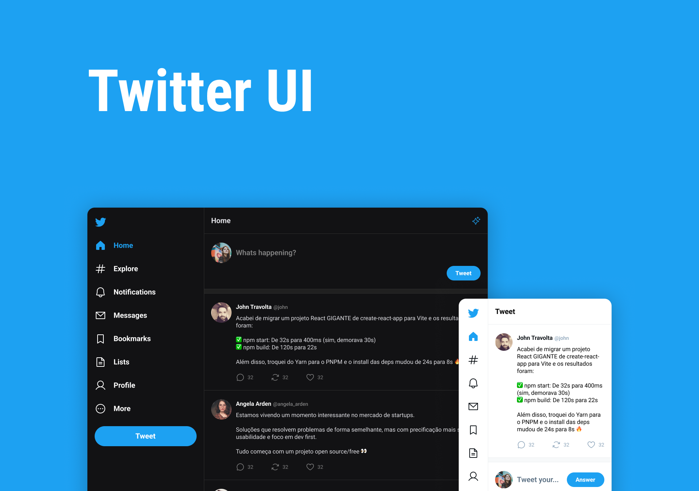

<p align="center">
  
  <hr />
</p>
<p align="center">
  Projeto desenvolvido para fins de estudo de novas tecnologias
</p>
<br>

# Sobre o projeto

Clone da interface do Twitter, com layout responsivo implementando as funcionalidades de autenticação com Google, postagem de um novo Tweet e respostas a esse tweet. Implementei também a troca de temas Light - Dark utilizando o Provider do Styled Components

<br>

<p align="center">
  
</p>
<br>

# Tecnologias utilizadas

- Typescript
- React
- Supabase
- React Router DOM
- Styled Components
- ContextAPI
- ESLint

# Inicialização

Para clonar o repositório, rode o seguinte comando no terminal:

```
git clone https://github.com/GersonRocha9/twitter-clone.git
```

Para rodar o projeto, entre na pasta do diretório raiz, e rode o comando para instalar as dependências:

```
npm i
```

Agora para iniciar o projeto, rode o comando:

```
npm run dev
```
